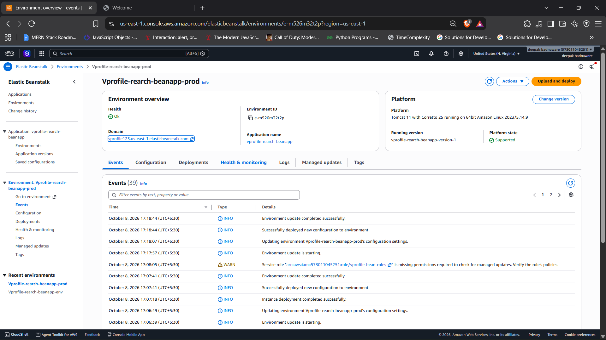

# Multi-Tier Java Application Deployment on AWS

Deployment of the vProfile Java web application on AWS using managed
services: Elastic Beanstalk, RDS, ElastiCache, Amazon MQ, and CloudFront.

## 📌 Overview

This project deploys the **vProfile** Java web application on AWS using managed services instead of self-hosted servers. The application is based on the open-source vProfile project, and I designed and deployed the AWS infrastructure for it.

The application runs on **AWS Elastic Beanstalk** (Tomcat) with load balancing and auto scaling. It uses **Amazon RDS (MySQL)** for data, **Amazon ElastiCache (Memcached)** to cache frequent queries, and **Amazon MQ (RabbitMQ)** for messaging. The tiers are connected inside a **VPC** and isolated with **security groups**, so backend services accept traffic only from the application layer.

**What I did:**
- Set up the networking, security groups, and IAM roles for each tier
- Provisioned and configured RDS, ElastiCache, and Amazon MQ
- Moved credentials out of the code into Elastic Beanstalk environment properties
- Built the WAR with Maven and deployed it to Elastic Beanstalk
- Troubleshot connectivity, IAM role, and configuration issues across services

## 🏗️ Architecture

**Request flow:**
1. A user opens the application URL.
2. The request reaches the **Application Load Balancer** created by Elastic Beanstalk, which distributes traffic across healthy instances.
3. The **Tomcat** application runs on EC2 instances managed by **Elastic Beanstalk**, with an Auto Scaling group that adds or removes instances based on load.
4. The application reads and writes data in **Amazon RDS (MySQL)** and caches frequent queries in **ElastiCache (Memcached)** to reduce database load.
5. **Amazon MQ (RabbitMQ)** handles asynchronous messaging between application components.
6. RDS, ElastiCache, and Amazon MQ accept traffic only from the application's security group, which keeps the backend tiers isolated.

| Service | Role in this project |
|---|---|
| Elastic Beanstalk | Hosts the Java (Tomcat) application with auto scaling and load balancing |
| RDS (MySQL) | Managed relational database for application data |
| ElastiCache (Memcached) | Caches frequent queries to reduce database load |
| Amazon MQ (RabbitMQ) | Managed message broker for asynchronous communication |
| Route 53 | DNS for the custom domain *(remove if not used)* |
| VPC / Security Groups | Network isolation and access control between tiers |
| IAM | Service role and instance profile permissions for Beanstalk and EC2 |

## 🛠️ Tech Stack
AWS Elastic Beanstalk, RDS, ElastiCache, Amazon MQ, CloudFront,
Route 53, VPC, IAM, Maven, Java, Tomcat

## ✅ Prerequisites
- AWS account 
- AWS CLI, Git, Maven, JDK installed

## 🚀 Setup Steps
1. Create security groups for each tier
2. Create the RDS MySQL instance and initialize the database
3. Create the ElastiCache (Memcached) cluster
4. Create the Amazon MQ (RabbitMQ) broker
5. Update `application.properties` with the endpoints
6. Build the artifact: `mvn clean install`
7. Create the Elastic Beanstalk environment and deploy the WAR file
8. Configure CloudFront and Route 53
9. Test the application

## 🔒 Security Practices
- Backend services allow traffic only from the application's security group
- IAM roles instead of hardcoded keys
- No credentials stored in the repo

## 📸 Screenshots

## 🧩 Challenges & Solutions

| Problem | Cause | Fix |
|---|---|---|
| RabbitMQ error: `invalid IPv6 address literal` | The `RABBITMQ_HOST` value included the port (`:5671`), so the client misread the extra colons as an IPv6 address | Set the host to the hostname only and passed the port separately through `RABBITMQ_PORT` |
| Beanstalk error: `Unable to assume role` for the service role | The role had the wrong trust relationship (an EC2-type role was selected as the service role) | Created a proper Elastic Beanstalk service role trusted by `elasticbeanstalk.amazonaws.com` with the managed health and update policies, and kept the EC2 role for the instance profile |
| Hardcoded passwords and endpoints in `application.properties` | Default config stored credentials directly in the file | Replaced them with `${VARIABLES}` placeholders, set real values as Beanstalk environment properties, added `.gitignore` entries, and rotated the old passwords |
| CloudFront blocked: `Your account must be verified` | New AWS accounts can be restricted from creating CloudFront distributions until verified | Opened an AWS Support case, and continued testing through the Beanstalk load balancer URL meanwhile |
| App could not connect to RDS | Security group missing inbound rule on 3306 | Added the app security group as the source |

## 📚 What I Learned

- **Managed services and networking:** How Elastic Beanstalk, RDS, ElastiCache, and Amazon MQ connect inside a VPC, and how security groups control which tier can talk to which (ports 3306, 11211, and 5671).
- **Secure configuration:** Why credentials should never live in code. I moved passwords and endpoints into environment variables, used `.gitignore` and example config files, and learned to rotate any secret that was exposed.
- **IAM roles:** The difference between the Elastic Beanstalk service role and the EC2 instance profile, including their trust relationships and required policies.
- **Troubleshooting:** How to find the root cause by reading Beanstalk logs (`catalina.out`), checking security group rules, and verifying configuration values, for example fixing a RabbitMQ host error caused by a port inside the hostname.

## 🔮 Future Improvements
- CI/CD with GitHub Actions
- Infrastructure as Code with Terraform
- CloudWatch alarms and dashboards
- HTTPS with ACM

## 🧹 Cleanup

Delete resources in this order to avoid AWS charges. Always use the same region (us-east-1).

### 1. Elastic Beanstalk
1. Open **Elastic Beanstalk → Environments**.
2. Select the environment, then **Actions → Terminate environment**.
3. Optionally delete the application and old application versions.

This removes the EC2 instances, load balancer, and Auto Scaling group.

### 2. CloudFront (only if created)
1. Open **CloudFront → Distributions**.
2. Select the distribution, click **Disable**, and wait until the status shows *Deployed*.
3. Click **Delete**.

### 3. Amazon MQ
1. Open **Amazon MQ → Brokers**.
2. Select the broker, then **Delete**, and confirm.

### 4. ElastiCache
1. Open **ElastiCache → Memcached clusters**.
2. Select the cluster, then **Actions → Delete**.
3. Delete the **subnet group** and **parameter group** if you created custom ones.

### 5. RDS
1. Open **RDS → Databases**.
2. Select the database, then **Actions → Delete**.
3. Uncheck "Create final snapshot" (if you don't need the data) and confirm.
4. Delete any **manual snapshots** and the **DB subnet group**.

### 6. Networking
1. Delete the **security groups** you created for each tier (EC2 → Security Groups). Delete the ones that reference others first.
2. If you created a custom VPC for the project, delete it last (this removes subnets, route tables, and gateways).

### 7. Other resources
- **Route 53:** delete the records and the hosted zone (a hosted zone costs about $0.50/month).
- **ACM:** delete unused certificates (they're free, but good to tidy).
- **S3:** delete the bucket Beanstalk created (named like `elasticbeanstalk-us-east-1-<account-id>`) after the environment is gone.
- **IAM:** delete the roles you created for this project, such as the service role and EC2 instance profile.
- **CloudWatch:** delete log groups and alarms.
- **SSM / Secrets Manager:** delete any secrets you stored (Secrets Manager charges per secret).

### 8. Verify nothing is left
- Open **Billing → Bills** and check there are no active services.
- Use **Resource Groups → Tag Editor** to search for resources in the region.
- Check **EC2 → Elastic IPs**, **Volumes**, and **Load Balancers** for leftovers.
- Set a **Budget alert** (Billing → Budgets) so unexpected costs notify you by email.

## 👤 Author
Deepak Badnaware | [LinkedIn](https://www.linkedin.com/in/deepakbadnaware/?isSelfProfile=true) | [GitHub](https://github.com/deepakbadnaware)