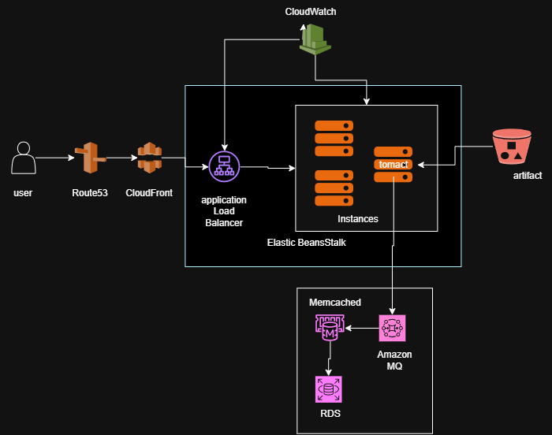
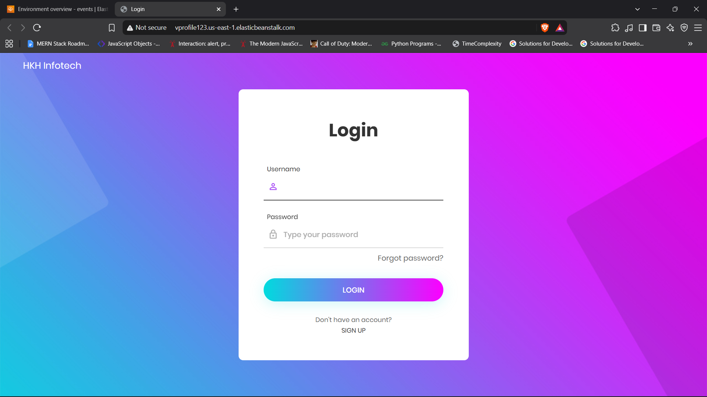
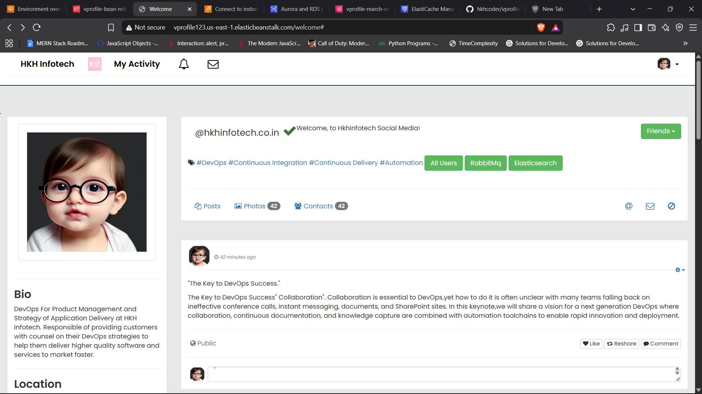
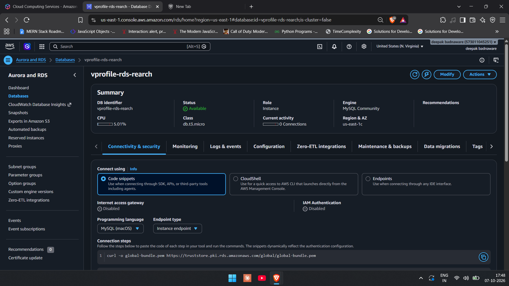

# Multi-Tier Java Application Deployment on AWS

Deployment of the vProfile Java web application on AWS using managed
services: Elastic Beanstalk, RDS, ElastiCache, Amazon MQ, and CloudFront.

## 📌 Overview
One short paragraph: what the project is, what problem it solves, and
what you built. Mention that the app is based on the open-source vProfile
project and that you designed and deployed the AWS infrastructure.

## 🏗️ Architecture
Explain the flow in 4-6 lines:
User → Route 53 → CloudFront → Elastic Beanstalk (Tomcat, auto scaling,
load balancer) → RDS (MySQL), ElastiCache (Memcached), Amazon MQ (RabbitMQ)

| Service | Role in this project |
|---|---|
| Elastic Beanstalk | Hosts the Java application with auto scaling and load balancing |
| RDS (MySQL) | Managed relational database |
| ElastiCache (Memcached) | Caches frequent queries to reduce DB load |
| Amazon MQ (RabbitMQ) | Message broker for asynchronous communication |
| CloudFront | CDN for faster content delivery |
| Route 53 | DNS for the custom domain |
| VPC / Security Groups | Network isolation and access control between tiers |
| IAM | Roles and permissions |

## 🛠️ Tech Stack
AWS Elastic Beanstalk, RDS, ElastiCache, Amazon MQ, CloudFront,
Route 53, VPC, IAM, Maven, Java, Tomcat

## ✅ Prerequisites
- AWS account (free tier is not enough for Amazon MQ and RDS, so expect small costs)
- AWS CLI, Git, Maven, JDK installed

## 🚀 Setup Steps
1. Create security groups for each tier
2. Create the RDS MySQL instance and initialize the database
3. Create the ElastiCache (Memcached) cluster
4. Create the Amazon MQ (RabbitMQ) broker
5. Update `application.properties` with the endpoints
6. Build the artifact: `mvn clean install`
7. Create the Elastic Beanstalk environment and deploy the WAR file
8. Configure CloudFront and Route 53
9. Test the application

(Link detailed steps in docs/setup-steps.md)

## 🔒 Security Practices
- Backend services allow traffic only from the application's security group
- IAM roles instead of hardcoded keys
- No credentials stored in the repo
(Only list what you really did.)

## 📸 Screenshots

## 🧩 Challenges & Solutions
| Problem | Cause | Fix |
|---|---|---|
| App could not connect to RDS | Security group missing inbound rule on 3306 | Added the app security group as the source |
| (add your real issues) | | |

## 📚 What I Learned
3-4 honest bullet points.

## 🔮 Future Improvements
- CI/CD with GitHub Actions
- Infrastructure as Code with Terraform
- CloudWatch alarms and dashboards
- HTTPS with ACM

## 🧹 Cleanup
Steps to delete all resources (Beanstalk, RDS, MQ, ElastiCache, CloudFront)
to avoid charges.

## 👤 Author
Deepak Badnaware | [LinkedIn](your-link) | [GitHub](your-link)